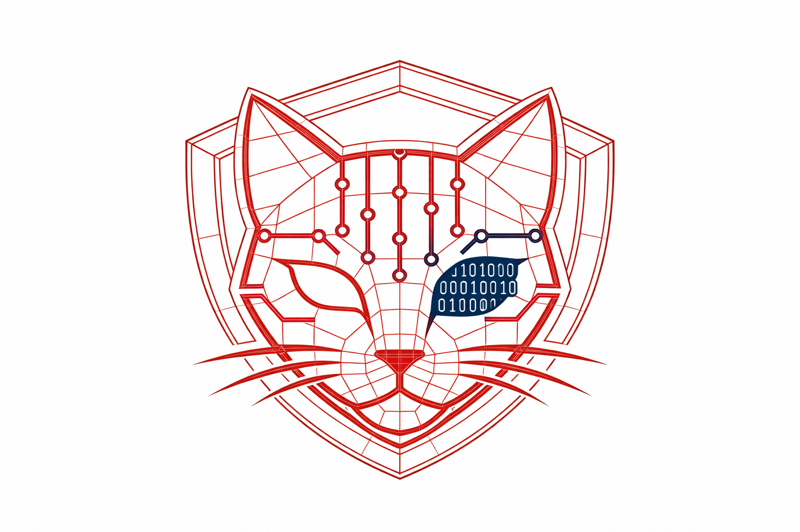
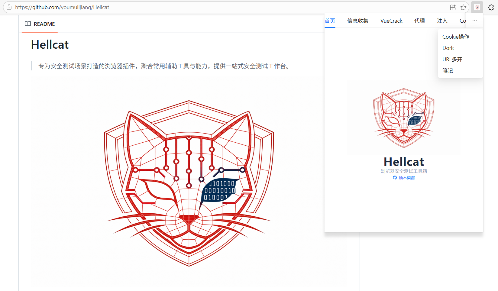

# Hellcat

> 专为安全测试场景打造的浏览器插件，聚合常用辅助工具与能力，提供一站式安全测试工作台。


## 简介

Hellcat 旨在帮助安全测试工程师、渗透测试人员和安全研究人员，减少在浏览器、抓包工具、编码工具、Payload 清单和信息整理之间来回切换的成本。

它将常见测试动作整合进浏览器使用流程中，让你在**查看页面、分析请求、复现问题、整理结果**时更顺手。

## 截图


## 它解决什么问题

- 减少工具切换带来的中断
- 提高页面测试、接口分析和信息收集效率
- 把常用操作沉淀为可重复使用的能力
- 让测试过程更集中，结果更容易整理

## 核心能力

### DevTools 工作台

- **抓包 / 重放**：在浏览器调试流程中直接捕获请求，查看请求与响应内容，并支持转发、丢弃、修改后重放，适合做接口验证、参数复测和问题复现。
- **WebSocket 测试**：查看连接、消息帧和帧详情，辅助分析实时通信过程，适合排查前后端交互、订阅消息和双向数据问题。
- **API 测试**：提供独立的请求调试能力，支持常见 HTTP 方法、参数、请求头和多种请求体配置，并保留历史记录，方便重复验证接口。
- **漏洞扫描**：基于已捕获的数据做启发式检测，帮助快速发现常见风险线索，例如 XSS、SQL 注入、敏感信息泄露和重定向类问题。
- **加密 / 解码**：覆盖编码解码、哈希摘要、对称 / 非对称加密、JWT 处理等高频场景，适合测试参数还原、签名分析和数据转换。
- **Payload 存储**：集中保存常用测试 Payload，减少临时查找和复制成本，让高频测试语句可以随取随用。
- **数据生成**：生成测试中常见的辅助内容，便于构造账号、身份、文本等测试数据，提高批量验证和表单测试效率。
- **Diff / 杂项工具**：补充日常测试中的高频小工具，例如文本比对、数据去重、域名提取、邮箱提取、正则提取等。
- **报告编写**：内置报告编辑能力，可直接记录测试过程与结论，并支持 Markdown 形式整理和导出，方便形成交付内容。

### Popup 快捷面板

- **信息收集**：自动提取页面及相关资源中的接口路径、域名、IP、邮箱、手机号、JWT、凭证、URL、JS 文件等信息，便于快速摸清目标暴露面。
- **VueCrack**：检测目标是否使用 Vue，并辅助分析路由与页面路径，帮助更快梳理前端路由结构。
- **代理**：支持保存和切换代理配置，管理代理模式与绕过列表，方便在不同测试链路之间快速切换。
- **注入**：支持脚本注入、文本注入和变量填充等能力，适合做页面辅助操作、前端验证和自动化填充。
- **Cookie 操作**：查看、搜索、新增、修改、删除、导入、导出 Cookie，便于进行会话复现、身份切换和状态验证。
- **Dork**：辅助构造搜索语句，减少手写成本，让信息检索和资产发现更高效。
- **URL 多开**：支持批量打开 URL，并提供幻灯片浏览、页面截图等能力，适合做批量访问、巡检和结果留存。
-  **笔记**：记录测试过程中的关键信息、发现的问题和待验证的点，方便后续整理和复盘。

## 适合谁使用

- 渗透测试工程师
- 安全研究人员
- 红队 / 蓝队中的应用安全人员
- 需要在浏览器环境中高频进行安全验证的人

## 典型使用方式

1. 打开目标站点
2. 在浏览器 DevTools 中进入 **Hellcat** 工作台
3. 进行抓包、重放、接口测试、编码处理或漏洞扫描
4. 通过 Popup 面板补充信息收集、Cookie、注入、Dork 等操作
5. 将结果汇总到报告模块，完成记录与输出

## 截图区

> 下面区域已预留，你可以直接替换为产品截图。

### 1. 总览



### 2. DevTools 工作台


### 3. Popup 面板


### 4. 漏洞扫描 / 报告示例


> 如果截图文件尚未准备好，可以先保留这些路径，后续补图即可。

## 快速开始

```bash
pnpm install
pnpm dev
```

构建产物：

```bash
pnpm build
```

## 声明

- 建议在**已授权**的目标环境中使用
- 本项目定位为**浏览器侧安全测试辅助工具**，更偏向提高工作流效率，而不是替代完整安全测试平台

## 鸣谢

本项目基于众多优秀的开源项目构建，在此向所有相关开发者与维护者致以诚挚的感谢：
- [SnowEyes](https://github.com/SickleSec/SnowEyes):优秀的前端安全检测与信息收集思路，为本插件的核心检测能力提供了重要参考。
- [AntiDebug_Breaker](https://github.com/0x727/AntiDebug_Breaker):反调试与前端防护绕过相关实现，为插件的安全测试辅助功能提供了技术借鉴。
- [VueCrack](https://github.com/Ad1euDa1e/VueCrack):前端框架逆向与数据解密相关思路，丰富了插件针对现代前端应用的测试能力。
- 项目所依赖的其他开源库：感谢每一个开源贡献者，让安全工具的开发更加便捷高效。
  
正是这些高质量的开源成果，才使得本安全测试辅助插件得以顺利实现。

## License

本项目基于 MIT License 开源发布，可自由使用、修改与分发，详见 LICENSE 文件。
使用本项目代码时，请遵守对应开源协议，保留原始版权及声明；项目中参考与借鉴的第三方开源项目，均遵循其各自开源许可协议。